# Engineering 4 Notebook
### Abby Paquette

## Caster
https://cvilleschools.onshape.com/documents/b2808aac29eeacb743ac81ca/w/590379e7b0e3669f823cc4b2/e/c5ecb9a9d0392c34d70e2faa
### Base
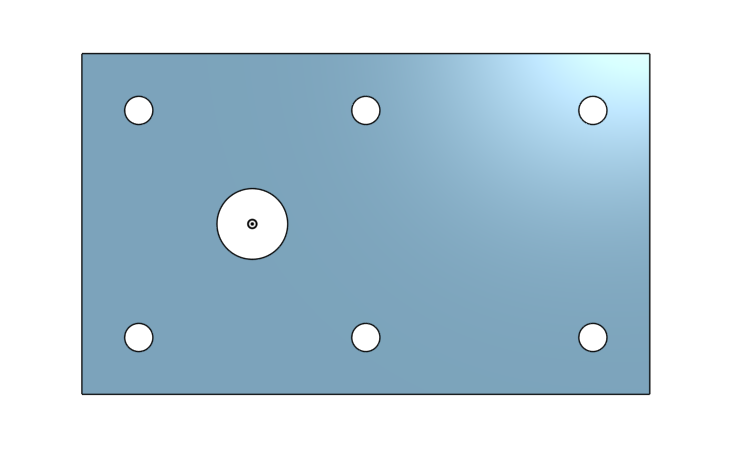
This is a base I made for a caster in onshape. This assignment was meant to be an introduction to onshape, and to just help us grasp how to use it and how onshape is similar to solidworks. For the base, I made a rectangle, and then add seven holes to it. The first hole is bigger and it is centered around the origin, while the other six are smaller and line the sides in a linear pattern. One thing that is new about onshape is that instead of selecting a separate options for cutting (making holes), you instead click on extrude, and then select remove to take away material. I also learned a bunch of new keyboard shortcuts that speed up the design process. You can always find them by going to the question mark icon at the top, but some of my favorites are "n" for normal to, "d" for dimension, "c" for circle, and "z" for zoom out.

### Mount
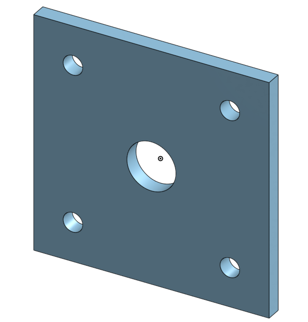 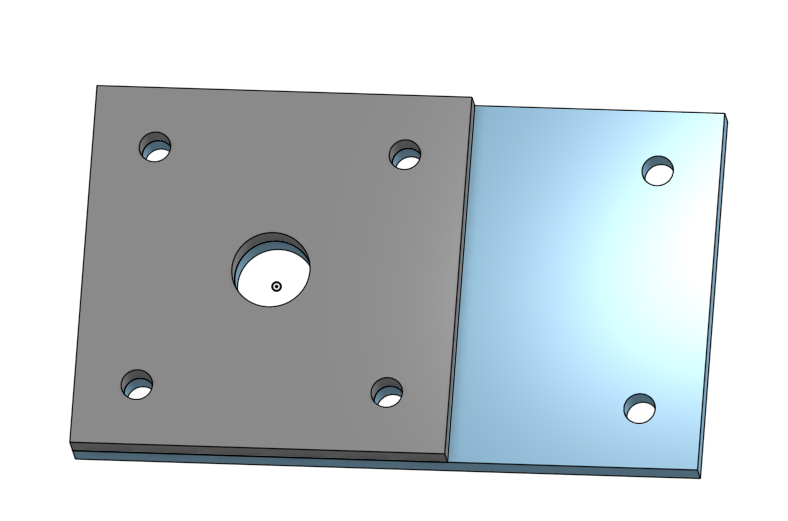

The mount is the second part of the caster that we are making. I made the same part three different ways, all of which had advantages and disadvantages. The first way was doing everything in the same sketch and feature, which includes drawing the holes in the same sketch as the first square. The second way was extruding the square, and then making two more sketches for the holes. This method allows for more flexibility if you want to supress or delete elements later on. Both these methods involve linear patterns for the four corner holes, but if you need to change the dimensions of the square, your hole placement gets all messed up. An effective way of preventing this is by making a variable, and then having the edge of your square be the variable while the distance between instances of the fraction can be relative to the variable. The third way to make the mount is in the same part studio as the base. This allows you to use existing geometry to make creating the part faster.

### Fork
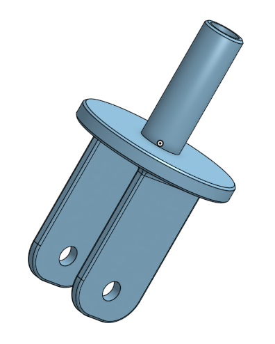 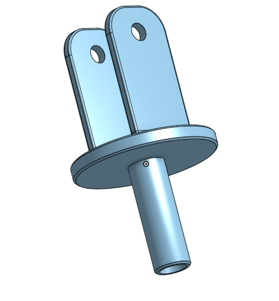

The fork was pretty quick to make, with one extrusion for the middle disc piece, one for the fork prongs on the bottom, and one for the tube on the top. There was also an additional cut for the hole through the prongs. This was my first time mirroring in onshape, and it was super easy and helpful. I also added chamfers and fillets along some of the edges.

### Tire
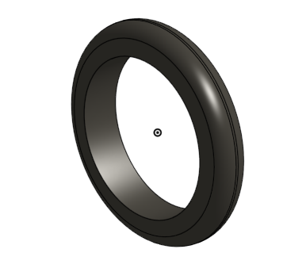

The tire was a super simple and easy assignment, with the only real new things being learning how to revolve in onshape. Something interesting that I learned about dimensioning, is that when you select something parallel to a centerline, and a centerline, if you have your mouse above the centerline, it shows you the plain distance between the two, but if you move your mouse below the line, it shows you double. When you are planning to revolve, this is basically just the radius and the diameter.

### Wheel
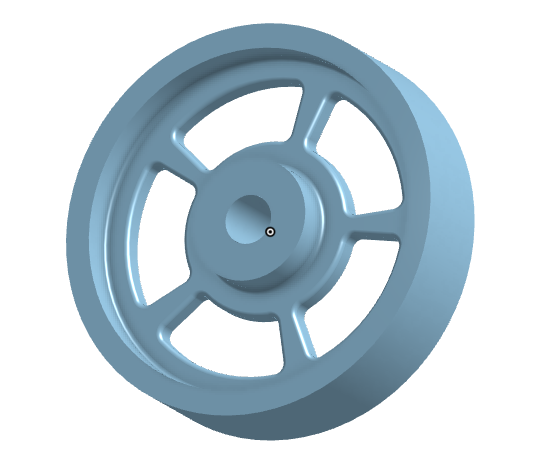

Again, this part was pretty quick and not that hard to make. I learned a bit more about selecting areas of a sketch to revolve or extrude, and I think it's nice that you can just select one region of a sketch to extrude or revolve. I also got more practice with how you relation things in onshape. Additionally, while making the wheel I got to change the render options, which isn't that exciting, but it was helpful to be able to look at the part with hidden edges. This picture is of the part shaded without edges, which is part of why everything looks so smooth.

### Axle, Collar, and Bearings
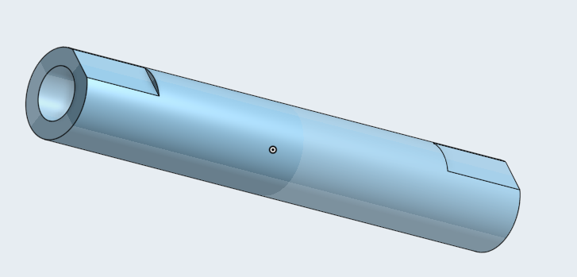 Axle
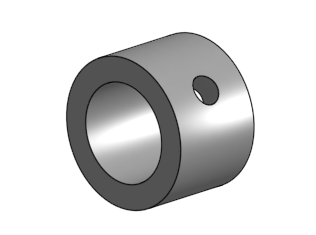 Collar
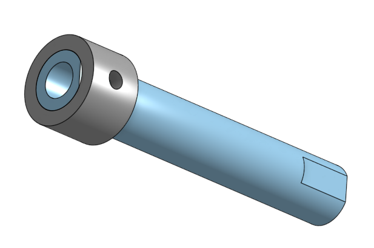 
Axle and Collar
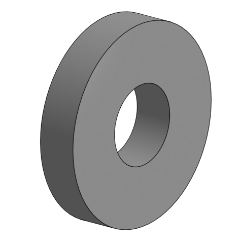 
Bearing
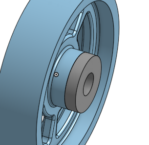 
Bearing and Wheel
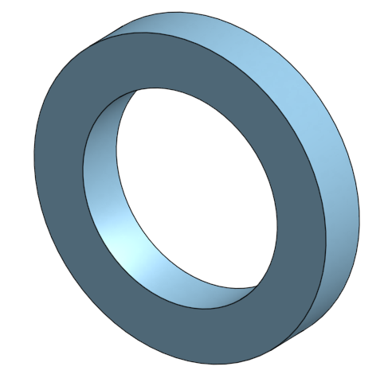 
Washer

In this assignment, I made a few little pieces for the assmebly. Two of the parts were a washer and a bearing, which were super simple,and the third part was the collar, which was also really easy, but it took me a few tries to get the hole in it right. The most complex part from this assignment was the axle, but the most important part of that was just making sure you extruded it midplane, or as it is called in onshape, "symmetric".

<*note*img src="Media/name_of_file" width="width_you_want">
